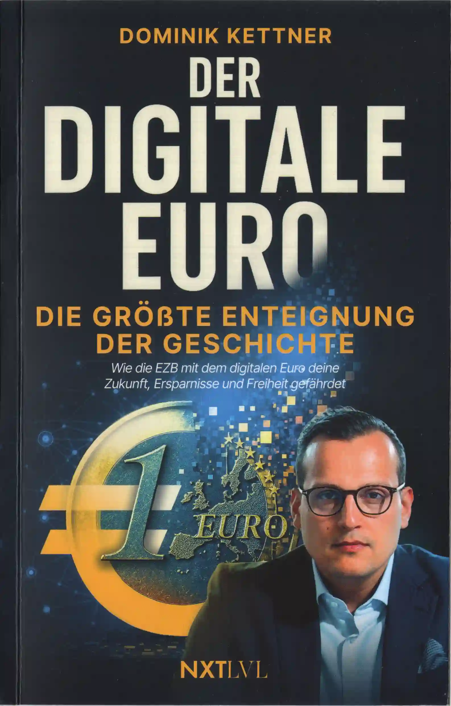

# Dominik Kettner - Der digitale Euro: Die größte Enteignung der Geschichte (2025)



https://www.amazon.de/dp/368936101X

<blockquote>

Der digitale Euro: Die größte Enteignung der Geschichte – Wie die EZB mit dem digitalen Euro deine Zukunft, Ersparnisse und Freiheit gefährdet und wie du dich dagegen schützt

Dominik Kettner (Autor)

4.6 out of 5 stars, (21) ratings

**Der digitale Euro – Wie die totale Kontrolle zur Realität wird**

Was einst als völlig undenkbar abgetan wurde, steht kurz vor der Umsetzung: **Der digitale Euro**

**Stell dir vor:**

- Dein Konto wird **gesperrt** , weil du die „falsche“ politische Meinung vertrittst.
- Deine Zahlungen werden **abgelehnt** , weil dein persönliches *CO2-Kontingent* verbraucht ist.
- Dein Vermögen wird **teilweise konfisziert** , weil der Staat eine Notlage ausruft – und du musst mit einem Teil deines Vermögens dafür haften.
- Dein Geld **verfällt** , weil es ein eingebautes Verfallsdatum hat und du es bis zu einem gewissen Zeitpunkt ausgegeben haben musst.

Szenarien wie diese – so unglaublich sie im ersten Moment klingen – werden schon bald Realität sein.

In **„Der digitale Euro“** zeigt Finanzexperte **Dominik Kettner** klar und für jedermann verständlich,
welche dramatischen Veränderungen diese neue digitale Zentralbank-Währung für dein Leben bedeutet –
und wie du dich davor schützen kannst.

Er legt offen, wie perfide Politik und Zentralbanken agieren,
um den digitalen Euro als *bessere und bequemere Alternative* zum Bargeld zu positionieren,
wie manipulativ sie dabei vorgehen und welche **krassen Einschränkungen** das Zentralbankgeld quasi auf Knopfdruck ermöglicht.

All das behauptet er nicht nur – er **belegt es lückenlos** mit Gesetzestexten und offiziellen Verlautbarungen der EZB,
so aufbereitet, dass es sogar sein sechsjähriger Sohn versteht.

**Mit diesem Buch wirst du verstehen:**

- **Warum** der digitale Euro die größte Enteignung der Menschheitsgeschichte bedeutet
- **Welche massiven Folgen** für Unternehmen, Gesellschaft und deine persönliche Sicherheit drohen
- **Warum** dieses Machtinstrument in den Händen einer eiskalten Elite zu einer nie dagewesenen Einschränkung unserer Freiheit führt
- **Welche konkreten Schritte** du JETZT unternehmen musst, um deine finanzielle Freiheit zu bewahren

- Herausgeber: Next Level Verlag
- Erscheinungstermin: 21. Oktober 2025
- Sprache: Deutsch
- Seitenzahl der Print-Ausgabe: 240 Seiten
- ISBN-10: 368936101X
- ISBN-13: 9783689361013
- Abmessungen: 13.5 x 2.6 x 20.9 cm
- Amazon Bestseller-Rang:
  - Nr. 17 in Bücher
  - Nr. 1 in Finanzpolitik (Bücher)
  - Nr. 2 in Kriege & Krisen (Bücher)
  - Nr. 2 in Soziologie-Referenz

</blockquote>

## scans

### TODO_BOOK_TORRENT_NAME

```
TODO_BOOK_TORRENT_MAGNET_LINK
```

## epub

- [github.com/milahu/der-digitale-euro-von-dominik-kettner-2025-epub](https://github.com/milahu/der-digitale-euro-von-dominik-kettner-2025-epub)

## mirrors

- https://github.com/milahu/der-digitale-euro-von-dominik-kettner-2025
- http://gg6zxtreajiijztyy5g6bt5o6l3qu32nrg7eulyemlhxwwl6enk6ghad.onion/milahu/der-digitale-euro-von-dominik-kettner-2025
- http://git.dkforestseeaaq2dqz2uflmlsybvnq2irzn4ygyvu53oazyorednviid.onion/milahu/der-digitale-euro-von-dominik-kettner-2025
- http://it7otdanqu7ktntxzm427cba6i53w6wlanlh23v5i3siqmos47pzhvyd.onion/milahu/der-digitale-euro-von-dominik-kettner-2025


## template

this repo is based on
[github.com/milahu/hocr-files-template-repo](https://github.com/milahu/hocr-files-template-repo).
if you want to copy this repo,
then please copy the template repo,
which has the latest versions of all files.
